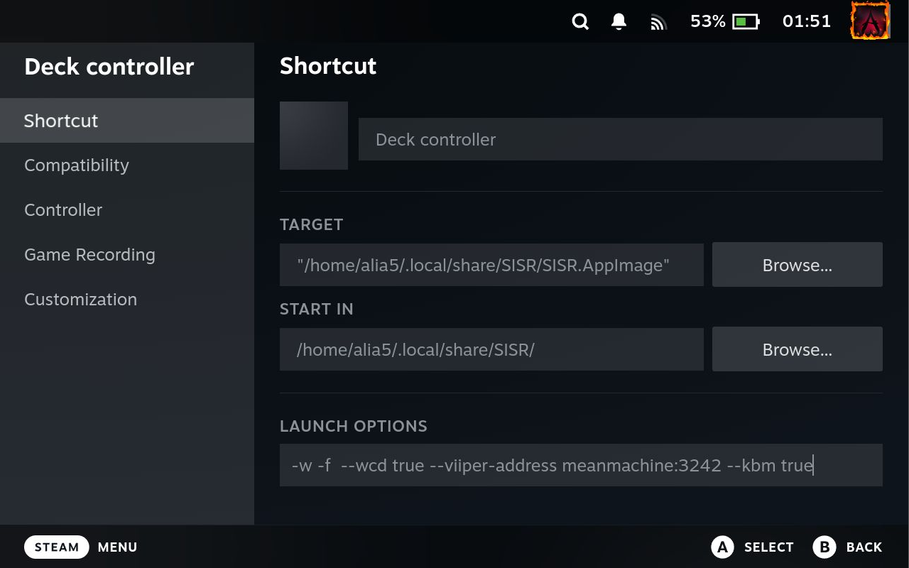

# 🌐 Networked usage

SISR can be used over the network to forward controllers, Keyboard/Mouse for game streaming scenarios  

This also allows you to use a Steam Deck (or similar devices)
as dedicated controllers without the need to stream the entire game

!!! note "No direct Deck passthrough"
    SISR does **not** directly passthrough the Decks built-in controller hardware  
    (or any direct controller passthrough, for that matter)  
    Instead, SISR forwards Steams Virtual Controllers created from the Decks inputs
    as Xbox360 controllers and a dedicated Keyboard/Mouse device.  

    While still not perfect, this approach circumvents many issues present in direct USBIP/VirtualHere passthrough solutions.

An explanation on why this can be preferable over other solutions can be found in the [FAQ](../misc/faq.md#why-would-i-want-to-use-this-instead-of-directly-using-usbipvirtualhere-to-forward-controllers)

---

!!! info "Installation"
    Installation for networked scenarios differs slightly, but is explained in this guide

## Receiving Machine (e.g. Gaming PC)

On the machine that will receive the forwarded controllers/Keyboard/Mouse (e.g. your Gaming PC)
you will not need to install SISR itself, only it's dependencies, USBIP and VIIPER

!!! tip
    If the receiving machine runs on 🐧 Linux
    **and** you have previosly installed SISR,
    you can skip the installation steps detauled here

    If the receiving machine runs on 🪟 Windows
    it is **strongly recommended** to use the VIIPER installation script **after** installing SISR on the receiving machine, to get a permanent VIIPER service setup 

### USBIP

Refer to the [USBIP setup guide](../getting-started/usbip.md)

!!! tip "SISR previously setup"
    If you have previously installed SISR on the receiving machine,
    USBIP should already be setup correctly

### VIIPER

VIIPER comes bundled with SISR on Windows, but on Linux it must always be installed as a system service.

For networked scenarios you will have to run VIIPER on the receiving machine yourself.  

Instead of always interacting with the receiving machine yourself, VIIPER can be run as a background service
that automatically starts with the system.  

VIIPER provides [easy to use installation scripts](https://alia5.github.io/VIIPER/stable/getting-started/installation/#automated-install-script)
for both Windows and Linux.  

=== "Windows"

    In a PowerShell run

    ```powershell
    irm https://alia5.github.io/VIIPER/stable/install.ps1 | iex
    ```

    This will
    
    - Install VIIPER to `%LOCALAPPDATA%\VIIPER\viiper.exe`
    - Set the VIIPER server to start automatically with Windows
    - Start the VIIPER server immediately
  
    !!! warning "USBIP not included"
        The VIIPER install script does not install/setup USBIP.
        Make sure a USBIP-client is installed and configured before installing VIIPER.

        The SISR install script should include everything you need, though

=== "Linux"

    In a terminal run

    ```bash
    curl -fsSL https://alia5.github.io/VIIPER/stable/install.sh | sh
    ```

    This will

    - install VIIPER to `/usr/local/bin/viiper`
    - Creates systemd service: `/etc/systemd/system/viiper.service`
    - Enables and starts the VIIPER service immediately

    !!! warning "USBIP not included"
        The VIIPER install script does not install/setup USBIP.
        Make sure a USBIP-client is installed and configured before installing VIIPER.

        The SISR install script should include everything you need, though

Refer to the [VIIPER documentation](https://alia5.github.io/VIIPER/) for more details and information

## Controller hosting machine (e.g. Steam Deck)

On the machine that will host the physical controllers/Keyboard/Mouse (e.g. your Steam Deck)
USBIP and VIIPER are not required, only SISR itself

!!! warning inline end "Marker shortcut"  
    You should **not** re-use the _"SISR Marker"_ shortcut  or add the `--marker` launch option here!

- Add SISR as a non-Steam game in your Steam library  
      Provide the following flags as launch options  
      - `-w -f --wcd true --kbm true --viiper-address <RECEIVING_MACHINE_IP>:3242`  
      <sup>show-window, fullscreen, continuous drawing, keyboard/mouse emulation, other machine address</sup>  
<br />

??? info "Click to reveal screenshot"
      
    Example Steam shortcut for using a Steam Deck as a dedicated controller

<br />

!!! tip inline end "Multiple Configurations"
    You can add SISR multiple times as non-Steam game to have multiple different Steam Input configurations available!

- Launch the newly created shortcut from Steam  
    This will start SISR and create virtual controllers, as well as forward Keyboard/Mouse inputs to the receiving machine

<br />
<br />

!!! tip "SISR overlay"
    If you want to stop/start forwarding or change settings while in-game,
    you can toggle the SISR overlay by using the keyboard-shortcut or controller-chord  
    (**`CTRL+SHIFT+ALT+S`**, **`LB+RB+BACK+A`** (_"A" button needs to be pressed last_))
